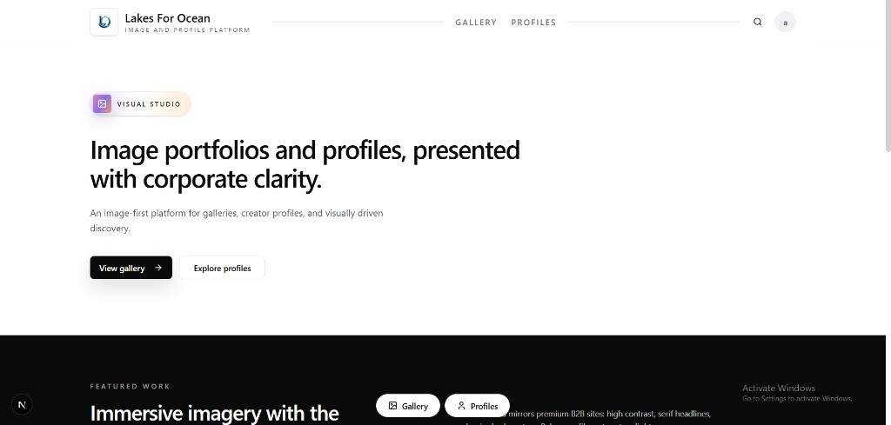
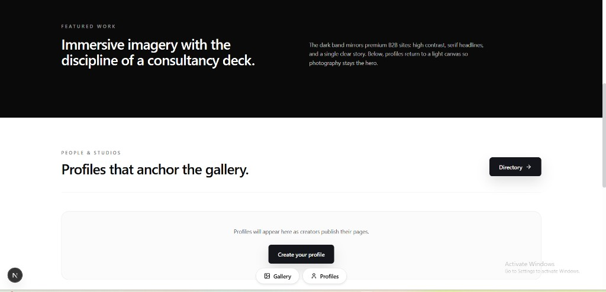

# Lakes For Ocean

Image-first Next.js site: gallery surfaces, creator profiles, and a minimal editorial shell (Pinion-style UI).

## UI screenshots

### Homepage — hero, navigation, and CTAs



### Featured work & profiles



## Development

```bash
pnpm install
pnpm dev
```

```bash
pnpm build
pnpm start
```

Screenshots are stored under [`docs/readme/`](./docs/readme/) so they render inline on GitHub from this repository.
